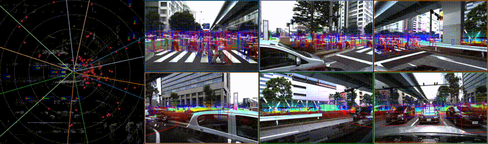

<!-- markdownlint-disable-next-line -->
[](https://www.tri.global/)


# Dataset Governance Policy (DGP)
[](https://app.travis-ci.com/github/TRI-ML/dgp/branches)
[](https://github.com/TRI-ML/dgp/actions/workflows/build-docker.yml)
[](https://github.com/TRI-ML/dgp/blob/master/LICENSE)
[](https://github.com/TRI-ML/dgp/issues)
[](https://tri-ml.github.io/dgp/)

To ensure the traceability, reproducibility and standardization for
all ML datasets and models generated and consumed within Toyota Research Institute (TRI), we developed the
Dataset-Governance-Policy (DGP) that codifies the schema and
maintenance of all TRI's Autonomous Vehicle (AV) datasets.

<p align="center">
  
</p>

## Components
- [Schema](dgp/proto/README.md): [Protobuf](https://developers.google.com/protocol-buffers)-based schemas for raw data, annotations
  and dataset management.
- [DataLoaders](dgp/datasets): Universal PyTorch DatasetClass to load all DGP-compliant datasets.
- [CLI](dgp/README.md): Main CLI for handling DGP datasets and the entrypoint of visulization tools.


## Getting Started
Please see [Getting Started](docs/GETTING_STARTED.md) for environment setup.

Getting started is as simple as initializing a dataset-class with the
relevant dataset JSON, raw data sensor names, annotation types, and
split information. Below, we show a few examples of initializing a
Pytorch dataset for multi-modal learning from 2D bounding boxes, and
3D bounding boxes.
```python
from dgp.datasets import SynchronizedSceneDataset

# Load synchronized pairs of camera and lidar frames, with 2d and 3d
# bounding box annotations.
dataset = SynchronizedSceneDataset('<dataset_name>_v0.0.json',
    datum_names=('camera_01', 'lidar'),
    requested_annotations=('bounding_box_2d', 'bounding_box_3d'),
    split='train')
```

## Examples
A list of starter scripts are provided in the [examples](examples/)
directory.
- [examples/load_dataset.py](examples/load_dataset.py): Simple example
  script to load a multi-modal dataset based on the **Getting
  Started** section above.

## Build and run tests
You can build the base docker image and run the tests within [docker container](docs/GETTING_STARTED.md#markdown-header-develop-within-docker)
via:
```sh
make docker-build
make docker-run-tests
```

## Contributing
We appreciate all contributions to DGP! To learn more about making a contribution to DGP, please see [Contribution Guidelines](docs/CONTRIBUTING.md).

## CI Ecosystem
| Job | CI | Notes |
| --- | --- | --- |
| master-build | [](https://app.travis-ci.com/github/TRI-ML/dgp/branches) | Master branch build|
| docker-build | [](https://github.com/TRI-ML/dgp/actions/workflows/build-docker.yml) | Docker build and push to [container registry](https://github.com/TRI-ML/dgp/pkgs/container/dgp)|
| pre-merge    | [](https://github.com/TRI-ML/dgp/actions/workflows/pre-merge.yml) | Pre-merge testing|

## 💬 Where to file bug reports

| Type                     | Platforms                                              |
| - | - |
| 🚨 **Bug Reports**       | [GitHub Issue Tracker](https://github.com/TRI-ML/dgp/issues) |
| 🎁 **Feature Requests**  | [GitHub Issue Tracker](https://github.com/TRI-ML/dgp/issues) |

## 👩‍💻  The Team 👨‍💻

DGP is developed and currently maintained by *Quincy Chen, Arjun Bhargava, Chao Fang, Chris Ochoa and Kuan-Hui Lee* from ML-Engineering team at [Toyota Research Institute (TRI)](https://www.tri.global/), with contributions coming from ML-Research team at TRI, [Woven Planet](https://www.woven-planet.global/en) and [Parallel Domain](https://paralleldomain.com/).
